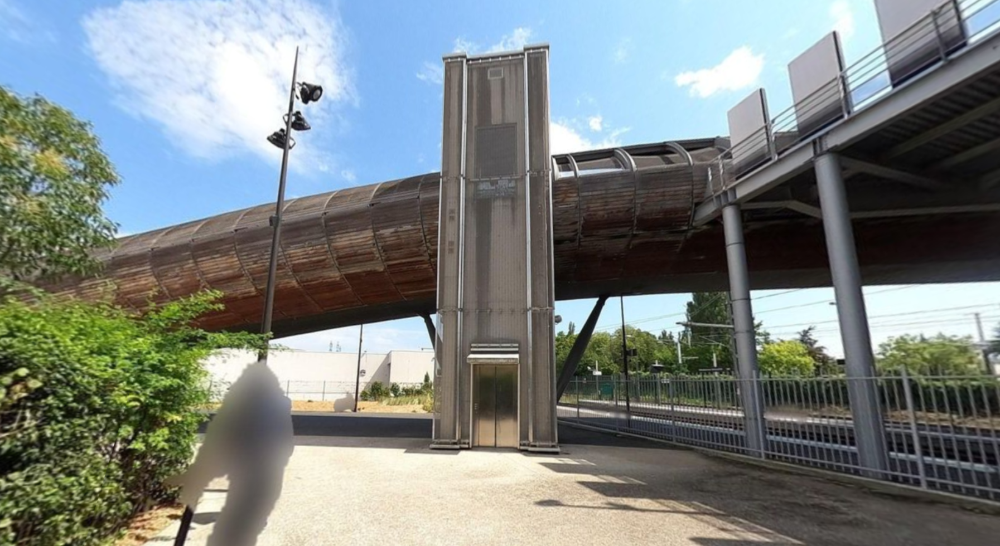
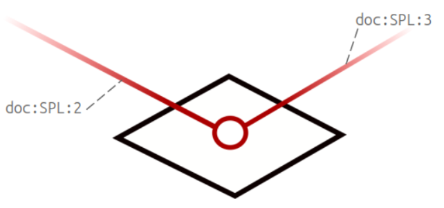
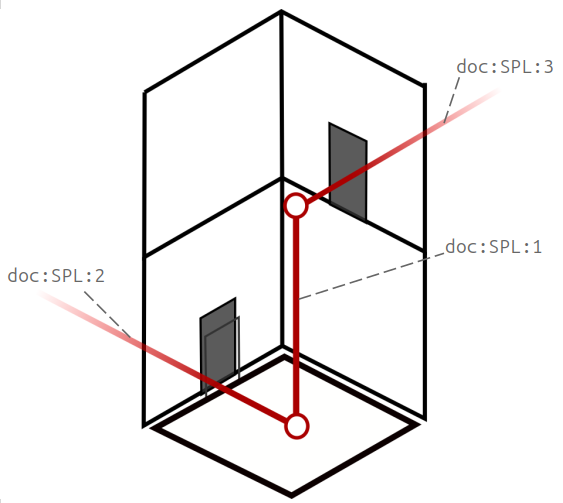

# Annexe - modélisation des ascenseurs

Il existe plusieurs manières de représenter les ascenseurs.

Prenons l'exemple suivant d'un ascenseur situé en voirie : il permet de rejoindre une passerelle qui enjambe des voies ferrées.


*Crédits photos : nlehuby pour SNCF Transilien, CC-BY-SA 4.0*

## Modélisation standard CNIG

Il peut être modélisé de la manière suivante : l'ascenseur a une géométrie ponctuelle, et on le retrouve à l'intersection de deux tronçons de cheminement.
C'est l'approche adoptée par le standard CNIG.



Cette modélisation est également possible avec NeTEx (mais n'est pas celle privilégie par les profils français et européens) : l'ascenseur y est alors un LiftEquipment, et on indiquera sa position au sein du SitePathLink/equipmentPlaces.

Les objets NeTex suivants seraient alors créés :

- l'équipement de l'ascenseur :

```xml
<LiftEquipment id="doc:LiftEquipment:1" version="1">(...)</LiftEquipment>
```

- le tronçon de cheminement du trottoir :

```xml
<SitePathLink id="doc:SPL:2" version="1">
        (...)
        <AccessFeatureType>pavement</AccessFeatureType>
        <equipmentPlaces>
            <EquipmentPlace id="doc:EquipmentPlace:1" version="any">
              <equipmentPositions>
                <EquipmentPosition id="doc:EquipmentPosition:1" version="any">
                  <EquipmentRef ref="doc:LiftEquipment:1" version="any"/>
                  <Location>
                    <Longitude>2.342343</Longitude>
                    <Latitude>48.960068</Latitude>
                  </Location>
                </EquipmentPosition>
              </equipmentPositions>
            </EquipmentPlace>
          </equipmentPlaces>
</SitePathLink>
```

- le tronçon de cheminement de la passerelle :

```xml
<SitePathLink id="doc:SPL:3" version="1">
        (...)
        <AccessFeatureType>footpath</AccessFeatureType>
        <PassageType>overpass</PassageType>
        <equipmentPlaces>
                <EquipmentPlaceRef ref="ALM:EquipmentPlace:1"/>
          </equipmentPlaces>
</SitePathLink>
```

## Modélisation profil France de NeTEx

NeTEx offre aussi une option plus complète de modélisation :



L'ascenseur est alors modélisé avec les deux objets suivants :

- un LiftEquipment
- un SitePathLink pour chaque niveau traversé. Il a une géométrie linéaire mais verticale (les coordonnées sont identiques, seule l'altitude change)

Voici le détail des objets créés dans ce cas :

- l'équipement de l'ascenseur :

```xml
<LiftEquipment id="doc:LiftEquipment:1" version="1">(...)</LiftEquipment>
```

- le tronçon de cheminement de l'ascenseur :

```xml
<SitePathLink id="doc:SPL:1" version="1"> 
        (...)
        <AccessFeatureType>lift</AccessFeatureType>
        <placeEquipments>
                <LiftEquipmentRef ref="doc:LiftEquipment:1"/>
        </placeEquipments>
</SitePathLink>
```

Remarque : si d'autres étages sont desservis, d'autres tronçons de cheminements avec AccessFeatureType=lift sont à prévoir.

- le tronçon de cheminement du trottoir :

```xml
<SitePathLink id="doc:SPL:2" version="1">
        (...)
        <AccessFeatureType>pavement</AccessFeatureType>
</SitePathLink>
```

- le tronçon de cheminement de la passerelle :

```xml
<SitePathLink id="doc:SPL:3" version="1">
        (...)
        <AccessFeatureType>footpath</AccessFeatureType>
        <PassageType>overpass</PassageType>
</SitePathLink>
```

Cette modélisation est celle préconisée par les profils français et européens, mais n'est pas possible dans le standard CNIG.
